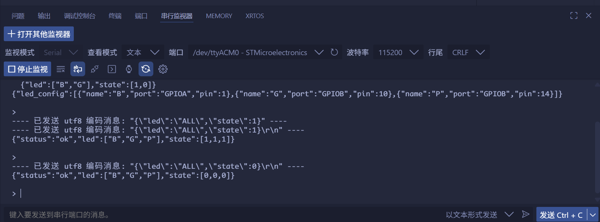

<!--
 * @Author: majorzpley wyx1214844230@outlook.com
 * @Date: 2026-01-31 10:45:41
 * @LastEditors: majorzpley wyx1214844230@outlook.com
 * @LastEditTime: 2026-02-05 16:10:52
 * @FilePath: /08_rocketpi_uart_control_led/readme.md
 * @Description: 
 * 不用客气，这是你应该谢的!
 * Copyright (c) 2026 by ${git_name_email}, All Rights Reserved. 
-->
# 一、debug问题
遇到的问题可以参考这篇帖子：https://community.platformio.org/t/python-error-on-vscode-cannot-start-debug-session/53407/5<br>
- 开发分支新增了对 Python 3.14 的支持
```bash
pio upgrade --dev
```

# 二、PlatformIO 配合 clangd 插件解决方案
由于微软自带插件的智能扫描运行起来太慢，故采用此方案，参考此篇文章：https://blog.csdn.net/weixin_44434849/article/details/127539447

在 *platform.ini* 中添加
```ini
build_flags = -Ilib -Isrc
```
在命令行输入：
```bash
pio run -t compiledb
```
即可生成.json文件
# 三、实验说明
```json
{"led":["B","G","P"],"state":[1,1,1]}
```
- 通过 USART2 创建一个简易的串口控制台，使用接近 cJSON 的命令格式控制 3 颗板载 LED (LED_B, LED_G, LED_P)。程序在上电后会输出 GPIO 映射以及示例命令，并在串口终端中提示输入。
- 硬件资源

|LED |	端口 |	引脚	|备注|
|----|--------|---------|------|
|B	|GPIOA	|PA1	|在 main.h 中定义为 LED_B_Pin|
|G	|GPIOB	|PB10	|LED_G_Pin|
|P	|GPIOB	|PB14	|LED_P_Pin|
- LED 通过晶体管反相驱动，GPIO 输出为低电平时亮起（LED_ACTIVE_LOW）。如需改为高电平点亮，可在 Core/Src/main.c 顶部将 **LED_ACTIVE_LOW** 宏改为 0。

# 四、使用命令示例
打开串口终端（115200 8N1），复位开发板，终端会显示 GPIO 配置和提示符。
发送单灯命令：
```json
{"led":"B","state":1}
```
发送多灯命令：
```json
{"led":["G","P"]"state":[1,0]}
```
一次性控制全部 LED：
```json
{"led":"ALL","state":0}
```
