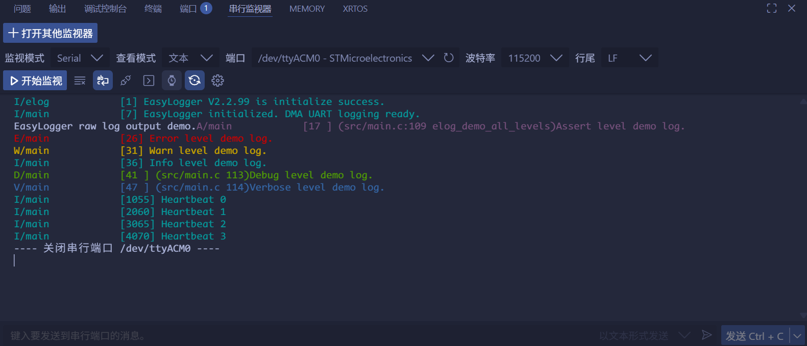

<!--
 * @Author: majorzpley wyx1214844230@outlook.com
 * @Date: 2026-01-31 10:45:41
 * @LastEditors: majorzpley wyx1214844230@outlook.com
 * @LastEditTime: 2026-02-08 16:09:35
 * @FilePath: /12_rocketpi_uart_easylogger/readme.md
 * @Description: 
 * 不用客气，这是你应该谢的!
 * Copyright (c) 2026 by ${git_name_email}, All Rights Reserved. 
-->
# 一、debug问题
遇到的问题可以参考这篇帖子：https://community.platformio.org/t/python-error-on-vscode-cannot-start-debug-session/53407/5<br>
- 开发分支新增了对 Python 3.14 的支持
```bash
pio upgrade --dev
```

# 二、PlatformIO 配合 clangd 插件解决方案
由于微软自带插件的智能扫描运行起来太慢，故采用此方案，参考此篇文章：https://blog.csdn.net/weixin_44434849/article/details/127539447

在 *platform.ini* 中添加
```ini
build_flags = -Ilib -Isrc
```
在命令行输入：
```bash
pio run -t compiledb
```
即可生成.json文件
# 三、注意事项
- 需要在 platform.ini 中加入
```ini
; add this folder to the linker paths so that ld script can be found
build_flags = -L.
; redirect ldscript
board_build.ldscript = STM32F401RETX_FLASH_CUSTOM.ld
```
# 四、实验说明
https://github.com/armink/EasyLogger
集成 EasyLogger 并通过 USART2 + DMA 输出日志。
- 自定义移植层 component/EasyLogger/easylogger/port/elog_port.c：
- 使用 HAL_UART_Transmit_DMA 在 USART2 上进行非阻塞输出。
- DMA 启动失败时自动退回阻塞式 HAL_UART_Transmit，保证日志一定能发出去。
- 提供简单的临界区锁 + HAL Tick 时间戳。
- 实现 HAL_UART_TxCpltCallback / HAL_UART_ErrorCallback，在 DMA 结束或出错时释放发送状态。
- elog_cfg.h 中默认使用 CRLF ("\r\n") 作为换行符，串口调试助手显示更友好。
- Core/Src/main.c 展示了完整流程：
- 初始化 EasyLogger、分别配置各级别的输出格式并调用 elog_start()。
- elog_demo_all_levels() 函数逐级打印 raw/assert/error/warn/info/debug/verbose 示例。
- 主循环每 1 秒输出一次心跳日志，证明 DMA 发送的实时性。
## 常用文件：
- EasyLogger/easylogger/inc/elog_cfg.h：编译期配置（缓冲区、颜色、换行等）。
- EasyLogger/easylogger/port/elog_port.c：与硬件相关的适配层（串口、锁、时间）。
# 五、实验现象
