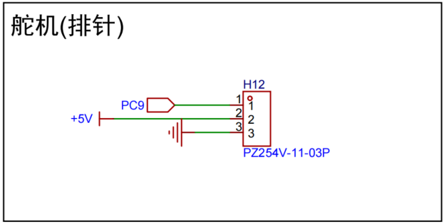
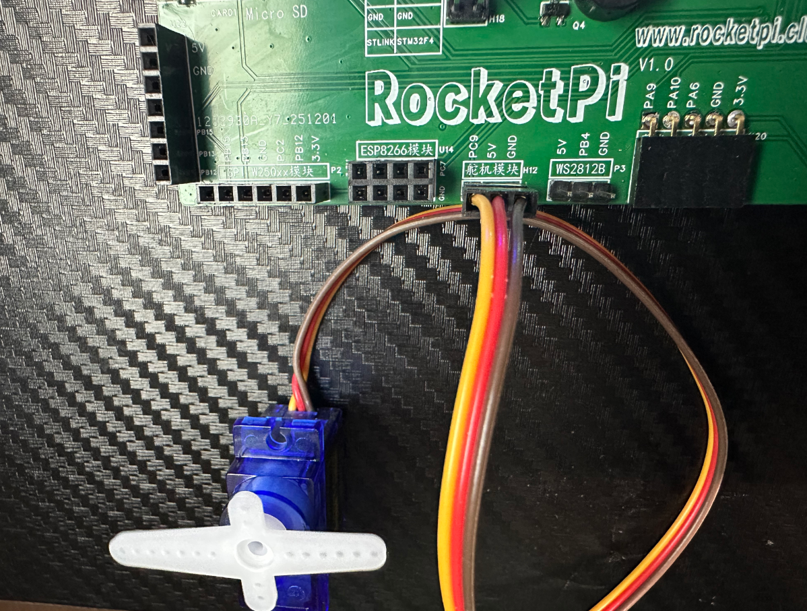
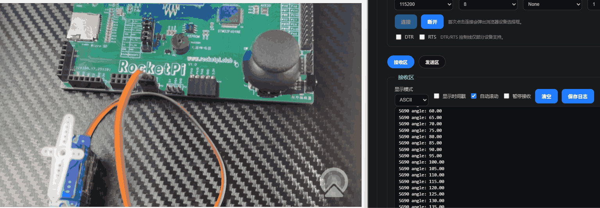
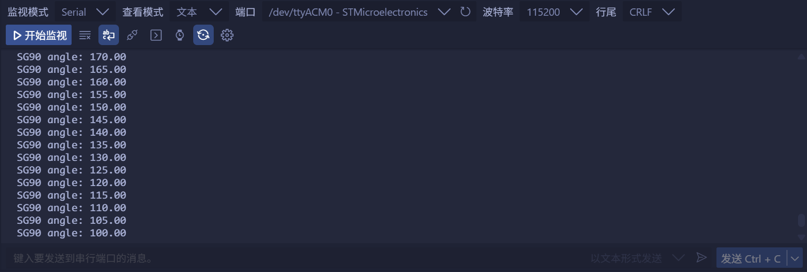

<!--
 * @Author: majorzpley wyx1214844230@outlook.com
 * @Date: 2026-01-31 10:45:41
 * @LastEditors: majorzpley wyx1214844230@outlook.com
 * @LastEditTime: 2026-02-11 20:35:14
 * @FilePath: /17_rocketpi_pwm_sg90/readme.md
 * @Description: 
 * 不用客气，这是你应该谢的!
 * Copyright (c) 2026 by ${git_name_email}, All Rights Reserved. 
-->
# 一、debug问题
遇到的问题可以参考这篇帖子：https://community.platformio.org/t/python-error-on-vscode-cannot-start-debug-session/53407/5<br>
- 开发分支新增了对 Python 3.14 的支持
```bash
pio upgrade --dev
```

# 二、PlatformIO 配合 clangd 插件解决方案
由于微软自带插件的智能扫描运行起来太慢，故采用此方案，参考此篇文章：https://blog.csdn.net/weixin_44434849/article/details/127539447

在 *platform.ini* 中添加
```ini
build_flags = -Ilib -Isrc
```
在命令行输入：
```bash
pio run -t compiledb
```
即可生成.json文件
# 三、实验说明
舵机0-180度来回转动，同时串口打印角度值
硬件连接:


- SG90驱动原理
    - SG90 是一种常见的小型舵机（servo motor），广泛应用于机器人、遥控模型等领域。它的工作原理基于 PWM（脉宽调制） 信号控制其旋转角度。下面是 SG90 舵机的驱动原理和控制方法：
    - SG90 是一种 伺服电机，它通过接收来自控制系统（如微控制器）发送的 PWM 信号，来控制其旋转角度。舵机的工作原理与其他舵机类似，但它的控制方式是通过调整输入信号的**脉宽**来实现角度控制的。
    1. PWM信号的工作方式
        - PWM（脉宽调制） 信号是一种周期性的方波信号，其周期保持固定，波形的宽度（高电平持续的时间）决定了舵机的角度。
        - 舵机的标准控制信号是一个 50 Hz 的 PWM 信号，即每 20 毫秒（20 ms）为一个周期。每个周期中的高电平持续时间决定舵机转动的角度。
    2. 控制信号与角度的关系
        SG90 通常使用 1 ms 到 2 ms 的脉宽来控制角度：
        - 1 ms 的脉宽信号通常对应舵机转到 0°。
        - 1.5 ms 的脉宽信号通常对应舵机转到 90°。
        - 2 ms 的脉宽信号通常对应舵机转到 180°。
        - 因此，控制信号的脉宽越长，舵机旋转的角度越大。
        - 举例：
            - **每 20 毫秒一个周期，高电平 1 毫秒时，舵机转到 0°。**
            - **每 20 毫秒一个周期，高电平 2 毫秒时，舵机转到 180°。**
    3. PWM信号的参数
        - 频率：舵机使用 50 Hz 的频率（即每 20 毫秒一个周期）。
        - 脉宽：脉宽通常在 1 ms 到 2 ms 之间，代表舵机的旋转角度。
        - 周期：周期保持为 20 毫秒，控制信号的宽度（高电平的持续时间）决定了舵机的角度。
    4. 如何控制 SG90
        - 通过调节 PWM 信号的脉宽，可以控制舵机的旋转角度。
# 四、实验演示

# 五、注意事项
由于实验需要打印浮点数，所以需要在**platformio.ini**中显示加入链接选项"**-Wl,-u,_printf_float**"。
