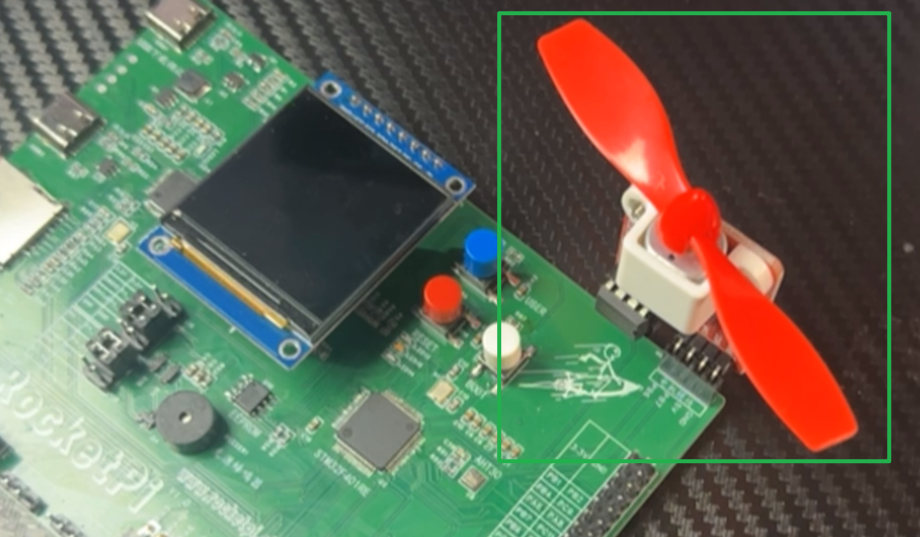
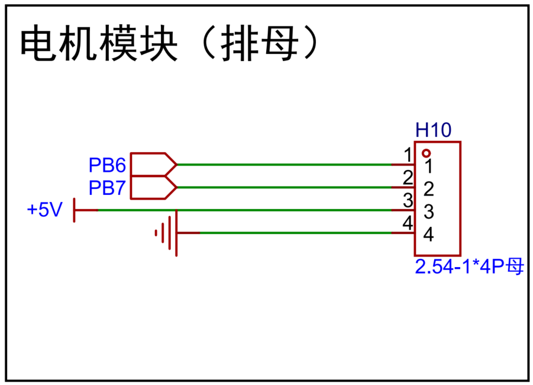

<!--
 * @Author: majorzpley wyx1214844230@outlook.com
 * @Date: 2026-01-31 10:45:41
 * @LastEditors: majorzpley wyx1214844230@outlook.com
 * @LastEditTime: 2026-02-11 21:49:12
 * @FilePath: /18_rocketpi_pwm_motor/readme.md
 * @Description: 使用PWM信号控制L9110直流电机驱动电路演示
 * 不用客气，这是你应该谢的!
 * Copyright (c) 2026 by ${git_name_email}, All Rights Reserved. 
-->
# 一、debug问题
遇到的问题可以参考这篇帖子：https://community.platformio.org/t/python-error-on-vscode-cannot-start-debug-session/53407/5<br>
- 开发分支新增了对 Python 3.14 的支持
```bash
pio upgrade --dev
```

# 二、PlatformIO 配合 clangd 插件解决方案
由于微软自带插件的智能扫描运行起来太慢，故采用此方案，参考此篇文章：https://blog.csdn.net/weixin_44434849/article/details/127539447

在 *platform.ini* 中添加
```ini
build_flags = -Ilib -Isrc
```
在命令行输入：
```bash
pio run -t compiledb
```
即可生成.json文件
# 三、实验说明
- TIM4 通道 1/2 输出 PWM 驱动 L9110：CH1→INB（PB6），CH2→INA（PB7），默认 20 kHz，可在 tim.c 调整。
- 刹车式 PWM：低电平阶段 IA=0、IB=0，低速力矩大、响应快。
- 驱动接口：motor_l9110_init、motor_l9110_drive（方向+占空比 0-100%）、motor_l9110_drive_signed（有符号占空比 ±100%）、motor_l9110_brake（双低刹车）。
- 演示状态机：motor_l9110_test_init/motor_l9110_test_task **循环慢速→加速→刹车→反转→加速→刹车**，可调 hold_ms 改各阶段时长。
硬件连接：


- 原理
    - IA / IB 的逻辑关系（数据手册真值表）
        - IA=H, IB=L → OA=H, OB=L（一个方向）
        - IA=L, IB=H → OA=L, OB=H（反方向）
        - IA=L, IB=L → OA=L, OB=L（刹车到地）
        - IA=H, IB=H → OA=L, OB=L（同样刹车）
没有“输出高电平滑行（coast）”，停时两端被拉低，更像动态刹车。

- 推荐的 PWM 调速接法（最简单、最安全）
    - 正转调速：IB = 0 固定，IA = PWM(duty)
    - 反转调速：IA = 0 固定，IB = PWM(duty)
    - 停/刹车：IA = 0, IB = 0（或都 1 也会停，但推荐双低）
    - 特点：PWM 的低电平阶段落在 IA=0、IB=0 → OA/OB 都为 0，即 PWM 刹车式调速（非滑行式）。

- PWM 频率
    - 默认配置约 20 kHz，可根据电机啸叫与发热情况在 10–20 kHz 之间调整。
# 四、实验演示
