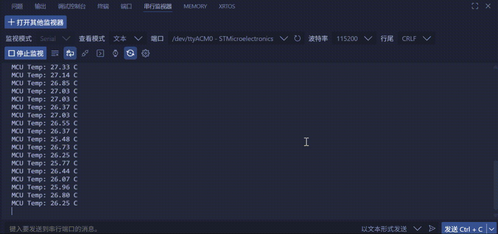

<!--
 * @Author: majorzpley wyx1214844230@outlook.com
 * @Date: 2026-01-31 10:45:41
 * @LastEditors: majorzpley wyx1214844230@outlook.com
 * @LastEditTime: 2026-02-14 10:17:31
 * @FilePath: /20_rocketpi_adc_mcu_temperature/readme.md
 * @Description: 
 * 不用客气，这是你应该谢的!
 * Copyright (c) 2026 by ${git_name_email}, All Rights Reserved. 
-->
# 一、debug问题
遇到的问题可以参考这篇帖子：https://community.platformio.org/t/python-error-on-vscode-cannot-start-debug-session/53407/5<br>
- 开发分支新增了对 Python 3.14 的支持
```bash
pio upgrade --dev
```

# 二、PlatformIO 配合 clangd 插件解决方案
由于微软自带插件的智能扫描运行起来太慢，故采用此方案，参考此篇文章：https://blog.csdn.net/weixin_44434849/article/details/127539447

在 *platform.ini* 中添加
```ini
build_flags = -Ilib -Isrc
```
在命令行输入：
```bash
pio run -t compiledb
```
即可生成.json文件
# 三、实验说明
该示例工程基于 STM32F4，使用 ADC1 轮询方式依次采集内部温度传感器（Channel 16）与内部基准电压 VREFINT（Channel 17），并结合工厂校准常数计算当前 MCU 芯片温度，最终通过 USART2 输出到终端。
- ADC1 配置为 12bit 分辨率、同步分频 4、单次软件触发，序列包含温度与 VREFINT 两个通道。
- 每次采样时会执行 5 组转换并取中值，结合校准常数（TS_CAL1/TS_CAL2）和实时 VDDA，得到更稳定的摄氏温度结果。
- 温度以 MCU Temp: xx.xx C 的格式每秒打印一次；若 ADC 读取失败，会输出 MCU Temp read failed 以便排查。
# 四、实验现象
