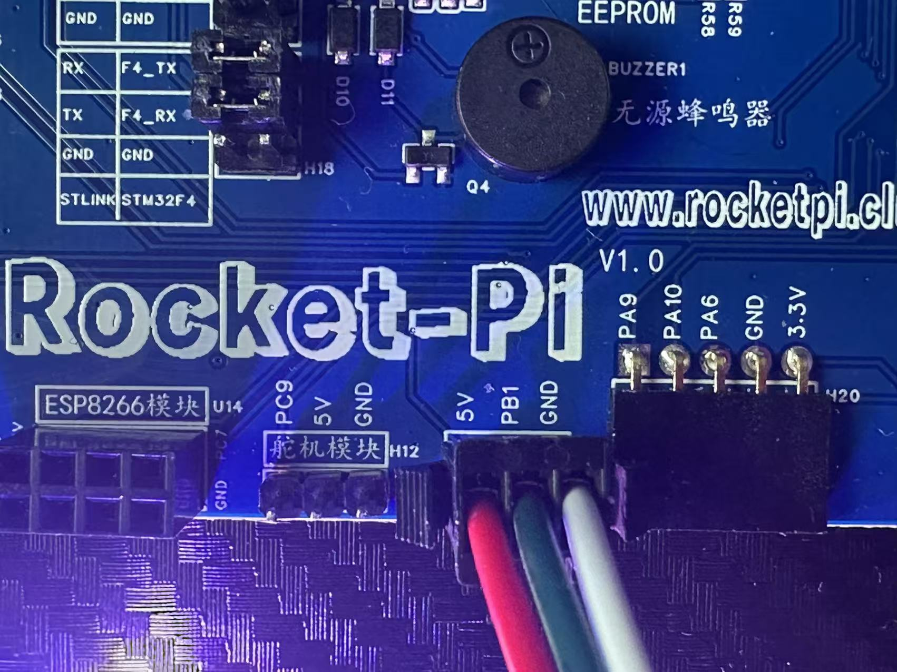
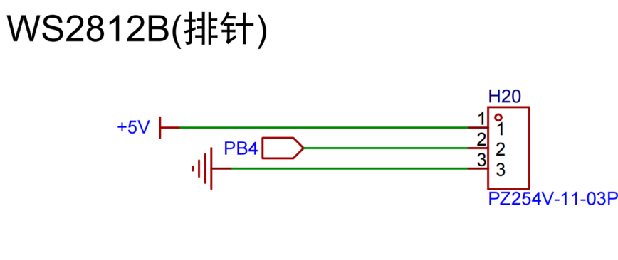
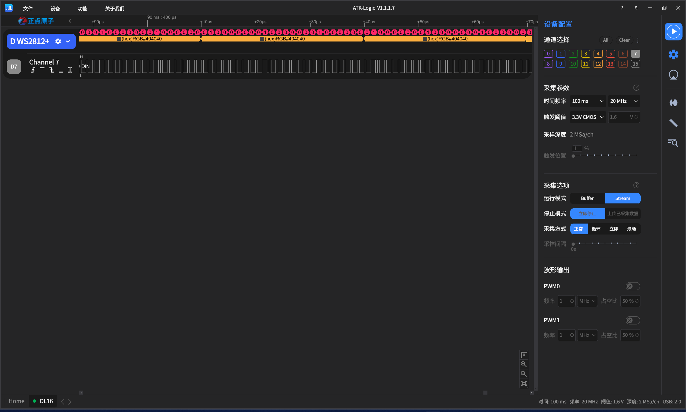

<!--
 * @Author: majorzpley wyx1214844230@outlook.com
 * @Date: 2026-01-31 10:45:41
 * @LastEditors: majorzpley wyx1214844230@outlook.com
 * @LastEditTime: 2026-02-15 22:36:01
 * @FilePath: /23_rocketpi_ws2812b/readme.md
 * @Description: 
 * 不用客气，这是你应该谢的!
 * Copyright (c) 2026 by ${git_name_email}, All Rights Reserved. 
-->
# 一、debug问题
遇到的问题可以参考这篇帖子：https://community.platformio.org/t/python-error-on-vscode-cannot-start-debug-session/53407/5<br>
- 开发分支新增了对 Python 3.14 的支持
```bash
pio upgrade --dev
```

# 二、PlatformIO 配合 clangd 插件解决方案
由于微软自带插件的智能扫描运行起来太慢，故采用此方案，参考此篇文章：https://blog.csdn.net/weixin_44434849/article/details/127539447

在 *platform.ini* 中添加
```ini
build_flags = -Ilib -Isrc
```
在命令行输入：
```bash
pio run -t compiledb
```
即可生成.json文件
# 三、实验说明
面向 RocketPI STM32F401RE 开发板的 WS2812B 灯带演示工程。主要特性：
- 使用 TIM3 + DMA 驱动 WS2812B，一次刷新整条灯带。
- 提供 driver_ws2812b 基础驱动，可自行设置任意 RGB 值。
- driver_ws2812b_test 内置多种灯效算法（呼吸、彩虹、追逐等），并支持按毫秒控制运行时长。
硬件连接
- WS2812B 数据线：PB1（TIM3_CH4，推挽，Very High）。
 电源：灯带接 5V （红色5V 白色GND 绿色Data）


# 四、实验现象
逻辑分析仪
