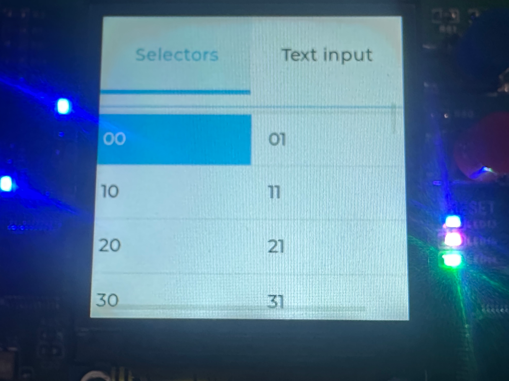

<!--
 * @Author: majorzpley wyx1214844230@outlook.com
 * @Date: 2026-01-31 10:45:41
 * @LastEditors: majorzpley wyx1214844230@outlook.com
 * @LastEditTime: 2026-02-25 20:27:17
 * @FilePath: /26_rocketpi_spi_lcd_240x240_lvgl/readme.md
 * @Description: 
 * 不用客气，这是你应该谢的!
 * Copyright (c) 2026 by ${git_name_email}, All Rights Reserved. 
-->
# 一、debug问题
遇到的问题可以参考这篇帖子：https://community.platformio.org/t/python-error-on-vscode-cannot-start-debug-session/53407/5<br>
- 开发分支新增了对 Python 3.14 的支持
```bash
pio upgrade --dev
```

# 二、PlatformIO 配合 clangd 插件解决方案
由于微软自带插件的智能扫描运行起来太慢，故采用此方案，参考此篇文章：https://blog.csdn.net/weixin_44434849/article/details/127539447

在 *platform.ini* 中添加
```ini
build_flags = -Ilib -Isrc
```
在命令行输入：
```bash
pio run -t compiledb
```
即可生成.json文件
# 三、实验说明
- 使用lvgl来将上个实验的图片显示在lcd上
- 移植lvgl9.2并适配摇杆作为输入

# 四、关于lvgl9.2版本在platformIO平台上手动移植的步骤
- 由于在pio中如果将lvgl放在lib目录下，工程默认是不会编译demos和porting文件夹下的内容的，所以需要增加library.json文件来手动指定需要编译的目录，可以参考我编写的来进行修改，下一个实验我会增加适配lvgl主线(目前是9.6版本)的工程