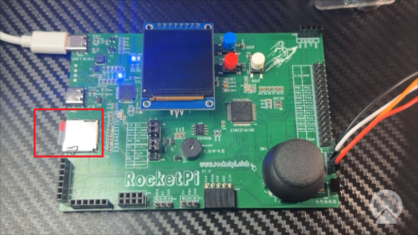
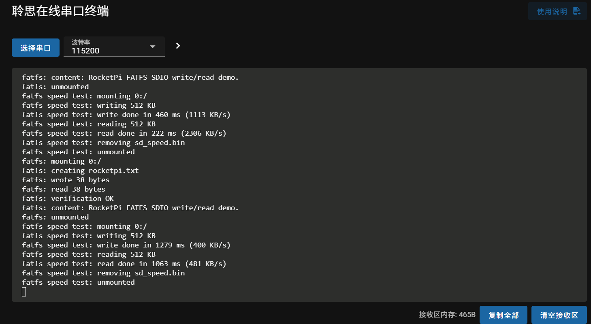
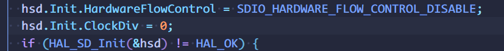

<!--
 * @Author: majorzpley wyx1214844230@outlook.com
 * @Date: 2026-01-31 10:45:41
 * @LastEditors: majorzpley wyx1214844230@outlook.com
 * @LastEditTime: 2026-03-02 11:26:38
 * @FilePath: /29_rocketpi_sdio_card_fatfs/readme.md
 * @Description: 
 * 不用客气，这是你应该谢的!
 * Copyright (c) 2026 by ${git_name_email}, All Rights Reserved. 
-->
# 一、debug问题
遇到的问题可以参考这篇帖子：https://community.platformio.org/t/python-error-on-vscode-cannot-start-debug-session/53407/5<br>
- 开发分支新增了对 Python 3.14 的支持
```bash
pio upgrade --dev
```

# 二、PlatformIO 配合 clangd 插件解决方案
由于微软自带插件的智能扫描运行起来太慢，故采用此方案，参考此篇文章：https://blog.csdn.net/weixin_44434849/article/details/127539447

在 *platform.ini* 中添加
```ini
build_flags = -Ilib -Isrc
```
在命令行输入：
```bash
pio run -t compiledb
```
即可生成.json文件
# 三、实验说明
面向 RocketPI STM32F401RE 开发板的 单线 SDIO MicroSD卡 FATFS 读写 演示工程。主要特性：
- 实现MicroSD卡的FATFS读写测试，
## 硬件连接

- 插入tf卡
- 目前测试支持品牌（闪迪，朗科）


# 四、已知bug
~~目前我移植的fatfs读写速率貌似小了很多，我对比了up的时钟配置是一样的，不知道是哪里出了问题，希望有人帮我找找bug，感谢!!!🙇‍~~

更新：找到原因了，分频系数写错了
