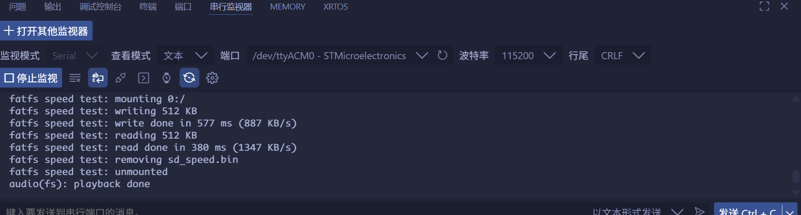
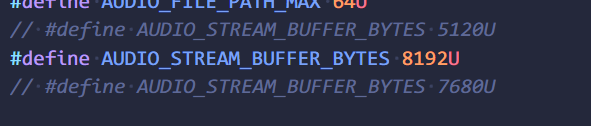

<!--
 * @Author: majorzpley wyx1214844230@outlook.com
 * @Date: 2026-01-31 10:45:41
 * @LastEditors: majorzpley wyx1214844230@outlook.com
 * @LastEditTime: 2026-03-02 23:49:34
 * @FilePath: /30_rocketpi_sd_audio_to_i2s/readme.md
 * @Description: 
 * 不用客气，这是你应该谢的!
 * Copyright (c) 2026 by ${git_name_email}, All Rights Reserved. 
-->
# 一、debug问题
遇到的问题可以参考这篇帖子：https://community.platformio.org/t/python-error-on-vscode-cannot-start-debug-session/53407/5<br>
- 开发分支新增了对 Python 3.14 的支持
```bash
pio upgrade --dev
```

# 二、PlatformIO 配合 clangd 插件解决方案
由于微软自带插件的智能扫描运行起来太慢，故采用此方案，参考此篇文章：https://blog.csdn.net/weixin_44434849/article/details/127539447

在 *platform.ini* 中添加
```ini
build_flags = -Ilib -Isrc
```
在命令行输入：
```bash
pio run -t compiledb
```
即可生成.json文件

# 三、实验说明
功能描述
- 从 SD 卡读取 16-bit PCM，经 I2S2+DMA 输出，可播放 SD 流和内置音轨。 （拷贝整个audio目录至sd卡根目录）
- FATFS 速度测试工具，用于测量 SD 写入/读取性能。
- ST7789 SPI 屏幕初始化并显示实时频谱（Goertzel 算法，40 个频段）。
使用
- 在 SD 根目录放置 audio/audio.bin，格式为 16 kHz、16-bit、立体声 PCM（与 AUDIO_SAMPLE_RATE_HZ/AUDIO_BITS_PER_SAMPLE/AUDIO_NUM_CHANNELS 一致）。
- 上电后自动播放：双缓冲从 SD 读取并送入 I2S DMA；SD 出错时可回退到编译时内置音轨。
- 频谱基于左声道数据，默认刷新周期 SPECTRUM_DRAW_INTERVAL_MS = 40ms。
- 宏 AUDIO_VOLUME_PERCENT（Core/Src/main.c），范围 0–100，默认 100。
- SD 流：每次从文件读入双缓冲后即按 Q15 乘法 + 饱和缩放； 内置音轨：先拷贝到 RAM 缓冲，再缩放后送 DMA。
- 0 = 静音，100 = 直通；修改宏后重新编译下载即可。

# 四、已知bug
目前，我使用up的mdk工程烧录后播放很流畅无卡顿，但是移植到pio上后播放明显卡顿，我修改了此处宏，将值修改为8192，经测试这个数值与up例程播放效果基本一致，猜测是由于我的sdio读取速度较慢一点导致dma每次传完数据后会有一个空窗期，所以我将dma的buffer改大这样与dma传输速度尽可能相匹配(并不是此buffer越大越好，因为里面会涉及到拷贝也会消耗时间)

# 五、注意
此工程我发现sdio使用的dma的通道与上个实验是相反的/(ㄒoㄒ)/~~