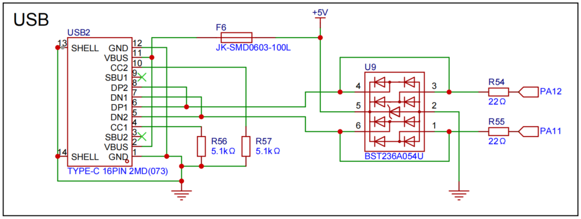
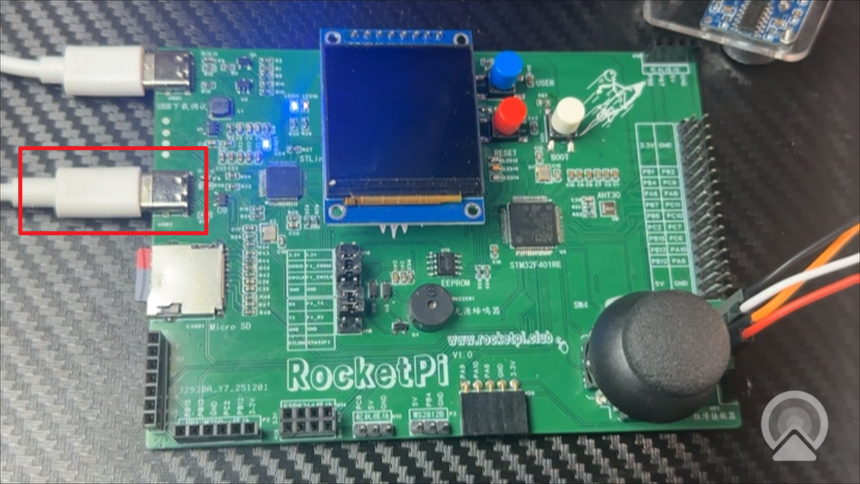
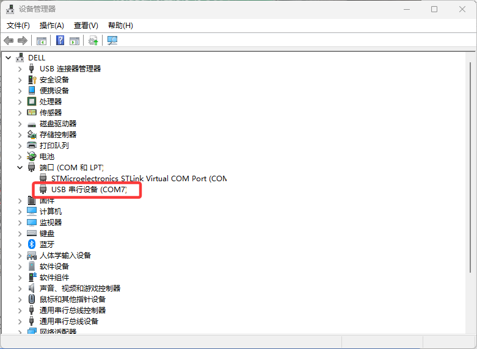
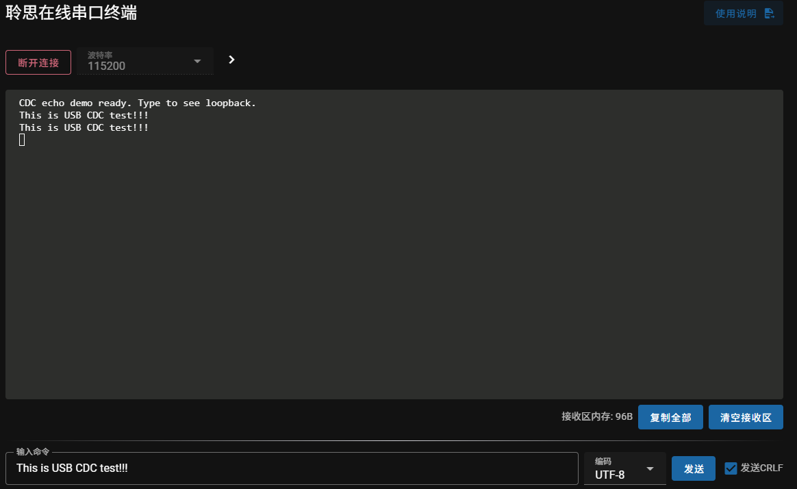

<!--
 * @Author: majorzpley wyx1214844230@outlook.com
 * @Date: 2026-01-31 10:45:41
 * @LastEditors: majorzpley wyx1214844230@outlook.com
 * @LastEditTime: 2026-03-04 12:53:55
 * @FilePath: /32_rocketpi_usb_cdc/readme.md
 * @Description: USB CDC 回环示例
 * 不用客气，这是你应该谢的!
 * Copyright (c) 2026 by ${git_name_email}, All Rights Reserved. 
-->
# 一、debug问题
遇到的问题可以参考这篇帖子：https://community.platformio.org/t/python-error-on-vscode-cannot-start-debug-session/53407/5<br>
- 开发分支新增了对 Python 3.14 的支持
```bash
pio upgrade --dev
```

# 二、PlatformIO 配合 clangd 插件解决方案
由于微软自带插件的智能扫描运行起来太慢，故采用此方案，参考此篇文章：https://blog.csdn.net/weixin_44434849/article/details/127539447

在 *platform.ini* 中添加
```ini
build_flags = -Ilib -Isrc
```
在命令行输入：
```bash
pio run -t compiledb
```
即可生成.json文件
# 三、实验说明
## USB CDC 回环示例
将 STM32F401 配置成 USB CDC（虚拟串口）回环设备。执行 MX_USB_DEVICE_Init() 后，开发板会以 VCP 形式枚举至 PC，用于验证主机与 MCU 之间的收发链路。
- 上电后固件只发送一次提示:CDC echo demo ready. Type to see loopback.
- 串口终端输入的每帧数据都会由 CDC 驱动缓存，并通过 CDC_Transmit_FS() 原样回传。
- 适合快速确认 USB 协议栈、时钟以及端点配置是否正常。
## 硬件连接


## 效果展示


## USB时钟说明
- HSE输入频率：通常为 8MHz（外部晶振）
- PLL输出：(HSE / PLLM) × PLLN = (8 / 4) × 168 = 336MHz
- USB时钟： 336MHz / PLLQ = 336 / 7 = 48MHz
1. USB 2.0规范要求：USB设备的时钟精度要求 ±0.25%，48MHz是USB全速设备的标准时钟频率
2. 允许的范围：理论上可以使用其他频率，但需要满足：
    - 频率精度在 ±0.25% 以内
    - 常见的替代频率：24MHz、18MHz等（通过分频得到）
3. 实际限制：
    - 如果改为其他PLLQ值，可能无法得到精确的48MHz
    - 频率偏差过大会导致USB通信不稳定甚至无法工作