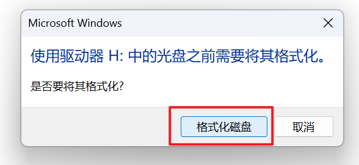
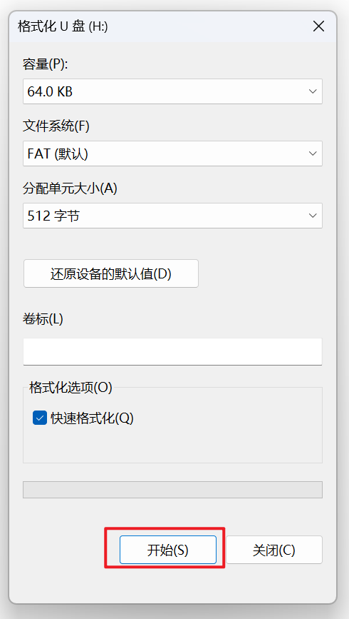

<!--
 * @Author: majorzpley wyx1214844230@outlook.com
 * @Date: 2026-01-31 10:45:41
 * @LastEditors: majorzpley wyx1214844230@outlook.com
 * @LastEditTime: 2026-03-04 15:00:43
 * @FilePath: /33_rocketpi_usb_msc/readme.md
 * @Description: 
 * 不用客气，这是你应该谢的!
 * Copyright (c) 2026 by ${git_name_email}, All Rights Reserved. 
-->
# 一、debug问题
遇到的问题可以参考这篇帖子：https://community.platformio.org/t/python-error-on-vscode-cannot-start-debug-session/53407/5<br>
- 开发分支新增了对 Python 3.14 的支持
```bash
pio upgrade --dev
```

# 二、PlatformIO 配合 clangd 插件解决方案
由于微软自带插件的智能扫描运行起来太慢，故采用此方案，参考此篇文章：https://blog.csdn.net/weixin_44434849/article/details/127539447

在 *platform.ini* 中添加
```ini
build_flags = -Ilib -Isrc
```
在命令行输入：
```bash
pio run -t compiledb
```
即可生成.json文件
# 三、实验说明
- 使用 64 KB 片上 SRAM 作为 USB MSC 介质，块大小 512 字节，共 128 个扇区
- usbd_storage_if.c 直接在 RAM 数组上实现 MSC 读写回调；掉电即失效，适合调试或临时数据交换。
- MSC_FlashStorage_Init() 会在首次调用时将 RAM 盘填充为 0xFF 并标记为可用。
## 使用步骤
1. main.c 已在 MX_USB_DEVICE_Init() 前调用 MSC_FlashStorage_Init()，上电后即可被 PC 枚举为 64 KB U 盘。
2. 首次连接时若提示“未格式化”，可在 PC 端使用 FAT/FAT12 快速格式化；RAM 盘容量仍较小，请勿选择 NTFS/exFAT。
3. 每次复位或断电后数据都会丢失，如需持久化请手动备份到 PC。
## 代码改动
- USB_DEVICE_App/usbd_storage_if.c：实现 48 KB RAM 盘、范围检查和 MSC 回调逻辑。
- USB_DEVICE_App/usbd_storage_if.h：保留 MSC_FlashStorage_Init() 对外接口。
- src/main.c：在 USB 初始化之前调用 RAM 盘初始化函数。
## 函数调用
```c
MY_USB_DEVICE_Init();

if (USBD_Start(&hUsbDeviceFS) != USBD_OK)

USBD_LL_Start(pdev);

hal_status = HAL_PCD_Start(pdev->pData);

STORAGE_Init_FS(uint8_t lun);//此函数已注册到dev设备

MSC_FlashStorage_Init();
```
## 硬件连接


