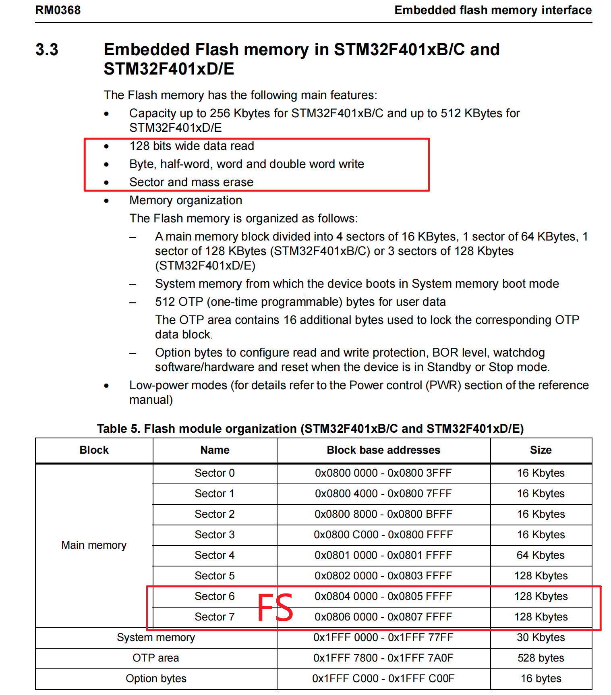
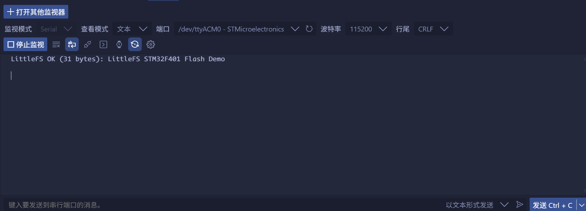

<!--
 * @Author: majorzpley wyx1214844230@outlook.com
 * @Date: 2026-01-31 10:45:41
 * @LastEditors: majorzpley wyx1214844230@outlook.com
 * @LastEditTime: 2026-03-04 22:18:22
 * @FilePath: /35_rocketpi_flash_littlefs/readme.md
 * @Description: 
 * 不用客气，这是你应该谢的!
 * Copyright (c) 2026 by ${git_name_email}, All Rights Reserved. 
-->
# 一、debug问题
遇到的问题可以参考这篇帖子：https://community.platformio.org/t/python-error-on-vscode-cannot-start-debug-session/53407/5<br>
- 开发分支新增了对 Python 3.14 的支持
```bash
pio upgrade --dev
```

# 二、PlatformIO 配合 clangd 插件解决方案
由于微软自带插件的智能扫描运行起来太慢，故采用此方案，参考此篇文章：https://blog.csdn.net/weixin_44434849/article/details/127539447

在 *platform.ini* 中添加
```ini
build_flags = -Ilib -Isrc
```
在命令行输入：
```bash
pio run -t compiledb
```
即可生成.json文件
# 三、实验说明
使用内部的flash后两个扇区 做littlefs文件系统
Sector 6 0x0804 0000 - 0x0805 FFFF 128 Kbytes
Sector 7 0x0806 0000 - 0x0807 FFFF 128 Kbytes
支持特性
- 128 位宽数据读取
- 字节、半字、字和双字写入
- 扇区和整片擦除
内部flash适合做不太频写的增量记录，比如日志，擦写次数有限，littlefs均衡磨损优于fatfs

**littlefs源码**:https://github.com/littlefs-project/littlefs


## littlefs vs FatFs
### （针对 MCU / SPI NOR 裸 Flash）
- **littlefs**
    - 设计目标就是：**直接跑在 NOR Flash 这类擦写受限的介质上。**
    - 内部做了 **日志式结构 + 动态/静态磨损均衡 + 断电一致性。**
    - **同一块数据反复更新时，不会总落在同一个物理块上，而是不断在不同块之间轮转。**
- **FatFs**
    - FatFs 本身只是 FAT 文件系统的实现，它假设下面是一个“**块设备**”：扇区读写随便搞，没有擦写限制。
    - **它自己不做磨损均衡**，所有写在哪个扇区由 FAT 逻辑决定，**经常改的目录区/FAT 表区会被疯狂写爆。**
    - 如果下面是“带 FTL 的设备”（SD 卡、U 盘、eMMC），**磨损均衡是控制器在做，不是 FatFs 在做。**
所以：
- **裸 NOR / MCU 内部 Flash：**
    - littlefs = 专门为这种介质设计，自带磨损均衡。
    - FatFs = 不会帮你做磨损均衡，用不好是“找死”的玩法。
- **SD 卡、U 盘这类带控制器的设备：**
    - 磨损均衡主要看存储芯片的控制器质量，
    - 用 littlefs 还是 FatFs，磨损均衡差异就没那么关键了。
## 硬件连接
无需连接任何外部硬件，片内flash用作文件系统
## 效果展示
