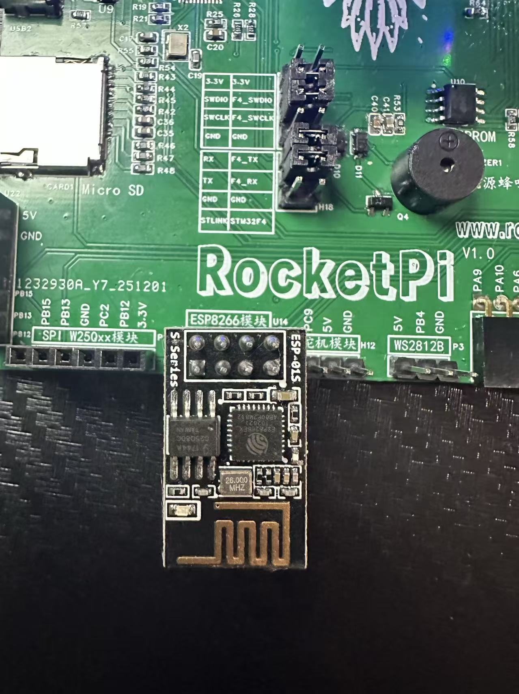
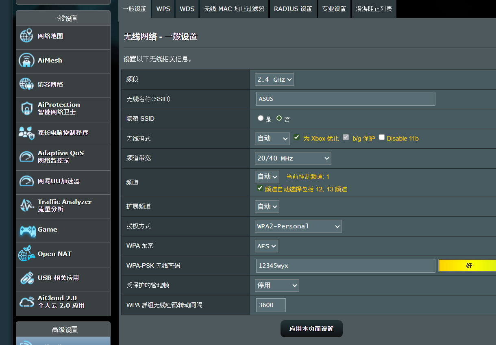

<!--
 * @Author: majorzpley wyx1214844230@outlook.com
 * @Date: 2026-01-31 10:45:41
 * @LastEditors: majorzpley wyx1214844230@outlook.com
 * @LastEditTime: 2026-03-05 20:18:50
 * @FilePath: /37_rocketpi_esp8266/readme.md
 * @Description: 
 * 不用客气，这是你应该谢的!
 * Copyright (c) 2026 by ${git_name_email}, All Rights Reserved. 
-->
# 一、debug问题
遇到的问题可以参考这篇帖子：https://community.platformio.org/t/python-error-on-vscode-cannot-start-debug-session/53407/5<br>
- 开发分支新增了对 Python 3.14 的支持
```bash
pio upgrade --dev
```

# 二、PlatformIO 配合 clangd 插件解决方案
由于微软自带插件的智能扫描运行起来太慢，故采用此方案，参考此篇文章：https://blog.csdn.net/weixin_44434849/article/details/127539447

在 *platform.ini* 中添加
```ini
build_flags = -Ilib -Isrc
```
在命令行输入：
```bash
pio run -t compiledb
```
即可生成.json文件
# 三、实验说明
## 功能说明
- 对基本的wifi指令测试
- 测试前请参考目录中的esp01s固件烧录文档，先给esp01s烧录支持mqtt的固件（rocketpi_esp8266 在此demo下）
测试前请在工程中更改wifi配置 driver_esp8266_at_test.c （注意只支持家中**2.4g频段的WIFI**）

测试流程如下:
- 串口与 AT 基础连通性
- 固件/版本信息读取
- WIFI STA 模式配置（IP信息获取，网关以及掩码）
- WIFI AP 模式配置验证（IP信息获取，网关以及掩码）
- MQTT配置订阅
- MQTT配置发布
- MQTT断开
- WIFI STA断开
- 结束
MQTT订阅主题 **/test/esp8266** 可收到测试消息
## 硬件连接

## 效果展示
# 四、已知bug
目前我能扫描到家里的2.4Gwifi，但是却连接不上
```bash
ERROR
+CWJAP: 4
```
，暂时不折腾了，可能是我路由器设置的问题，我尝试很久依然没法解决，先上传代码吧，源码应该时没有问题的
