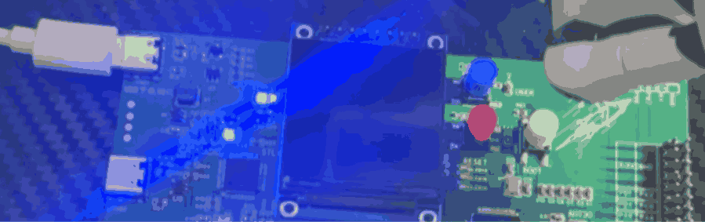

<!--
 * @Author: majorzpley wyx1214844230@outlook.com
 * @Date: 2026-01-31 10:45:41
 * @LastEditors: majorzpley wyx1214844230@outlook.com
 * @LastEditTime: 2026-01-31 11:54:28
 * @FilePath: /00_rocketpi_template/readme.md
 * @Description: 
 * 不用客气，这是你应该谢的!
 * Copyright (c) 2026 by ${git_name_email}, All Rights Reserved. 
-->
# 一、debug问题
遇到的问题可以参考这篇帖子：https://community.platformio.org/t/python-error-on-vscode-cannot-start-debug-session/53407/5<br>
- 开发分支新增了对 Python 3.14 的支持
```bash
pio upgrade --dev
```

# 二、PlatformIO 配合 clangd 插件解决方案
由于微软自带插件的智能扫描运行起来太慢，故采用此方案，参考此篇文章：https://blog.csdn.net/weixin_44434849/article/details/127539447

在 *platform.ini* 中添加
```ini
build_flags = -Ilib -Isrc
```
在命令行输入：
```bash
pio run -t compiledb
```
即可生成.json文件
# 三、实验说明
## 功能说明 
- 上电后启用全部可用外设时钟，方便在普通运行模式下测量（并对比），再进入低功耗模式前做参考。
- 检查 PWR_FLAG_SB 判断是否为 Standby 唤醒：若是，清除唤醒/Standby 标志并点亮三色 LED；若不是，保持三色 LED 熄灭。
- 延时 3 秒便于观察 LED 状态后，通过 PWR_WAKEUP_PIN1（PA0）配置唤醒源并进入 Standby 模式。
- PA0 触发唤醒后程序重新启动并执行同样逻辑，可用来验证 Standby 进出及唤醒标志处理。
