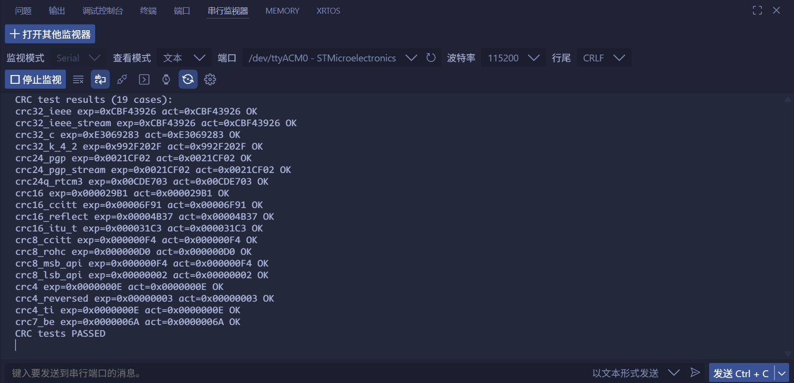

<!--
 * @Author: majorzpley wyx1214844230@outlook.com
 * @Date: 2026-01-31 10:45:41
 * @LastEditors: majorzpley wyx1214844230@outlook.com
 * @LastEditTime: 2026-03-07 17:54:19
 * @FilePath: /40_rocketpi_crc/readme.md
 * @Description: 
 * 不用客气，这是你应该谢的!
 * Copyright (c) 2026 by ${git_name_email}, All Rights Reserved. 
-->
# 一、debug问题
遇到的问题可以参考这篇帖子：https://community.platformio.org/t/python-error-on-vscode-cannot-start-debug-session/53407/5<br>
- 开发分支新增了对 Python 3.14 的支持
```bash
pio upgrade --dev
```

# 二、PlatformIO 配合 clangd 插件解决方案
由于微软自带插件的智能扫描运行起来太慢，故采用此方案，参考此篇文章：https://blog.csdn.net/weixin_44434849/article/details/127539447

在 *platform.ini* 中添加
```ini
build_flags = -Ilib -Isrc
```
在命令行输入：
```bash
pio run -t compiledb
```
即可生成.json文件
# 三、实验说明
## 功能说明
- 集成 component/crc 目录下的多种 CRC 软件实现（CRC4/7/8/16/24/32、CRC32C、CRC32K/4.2 等），并提供统一的 crc.h 接口方便裸机项目引用。
- 新增 component/crc/crc_test.c 与 crc_test.h 自检框架，内置 123456789 标准向量，对每一个 CRC 算法执行期望值对比，可在主函数中通过 crc_run_all_tests() 获取结果。
- src/main.c 中在系统初始化后调用 CRC 自检，并通过 USART2 打印每项的期望/实测值以及整体 PASS/FAIL，若存在错误会进入 Error_Handler 便于调试。

## 在线校验
https://www.lddgo.net/encrypt/crc

## 效果展示
