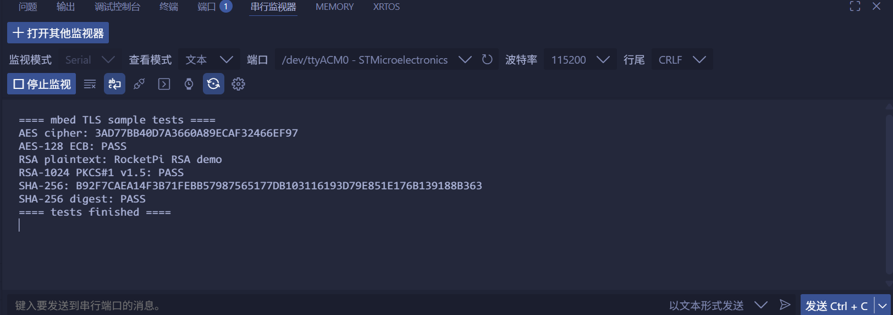

<!--
 * @Author: majorzpley wyx1214844230@outlook.com
 * @Date: 2026-01-31 10:45:41
 * @LastEditors: majorzpley wyx1214844230@outlook.com
 * @LastEditTime: 2026-03-08 12:54:29
 * @FilePath: /41_rocketpi_mbedtls/readme.md
 * @Description: 
 * 不用客气，这是你应该谢的!
 * Copyright (c) 2026 by ${git_name_email}, All Rights Reserved. 
-->
# 一、debug问题
遇到的问题可以参考这篇帖子：https://community.platformio.org/t/python-error-on-vscode-cannot-start-debug-session/53407/5<br>
- 开发分支新增了对 Python 3.14 的支持
```bash
pio upgrade --dev
```

# 二、PlatformIO 配合 clangd 插件解决方案
由于微软自带插件的智能扫描运行起来太慢，故采用此方案，参考此篇文章：https://blog.csdn.net/weixin_44434849/article/details/127539447

在 *platform.ini* 中添加
```ini
build_flags = -Ilib -Isrc
```
在命令行输入：
```bash
pio run -t compiledb
```
即可生成.json文件
# 三、实验说明
## 集成 mbed TLS 并在 src/main.c 中加入以下三个示例用例，用于验证加密库可用性：
- AES-128 ECB：使用 NIST 标准向量执行一次加密和解密，串口打印密文并给出 PASS/FAIL。
- RSA-1024 PKCS#1 v1.5：导入 mbed TLS 官方自测用的 1024 位密钥对，完成加密和解密，串口输出解密得到的明文。
- SHA-256：对固定字符串 RocketPi MBEDTLS 求哈希，串口打印 32 字节摘要并校验是否吻合。
## 效果展示

# 四、相关资料
mbedTLS（读作 M-bed T-L-S）是一个为嵌入式系统量身打造的开源 SSL/TLS 协议栈，你可以把它理解为一个专为资源受限设备（如物联网设备）设计的“安全通信工具箱”。它用 C 语言编写，以代码体积小、对硬件要求低而著称，能让各种小型设备轻松具备网络通信加密能力。

它的核心功能可以概括为以下几点：

🔐 核心密码学：提供了丰富的加密算法，包括 AES、RSA、ECC、SHA-256 等，以及中国的国密算法（如 SM2、SM3、SM4），为数据安全提供底层基础。

📜 数字证书处理：支持 X.509 国际标准证书的解析和验证。简单来说，它能帮设备“看懂”并校验网站或其他设备的“网络身份证”。

🌐 网络通信加密：完整实现了 SSL/TLS 协议（确保 HTTPS 安全连接）及其在 UDP 上的版本 DTLS，为网络数据传输穿上一层“防窃听、防篡改”的铠甲。

mbedTLS 在设计上非常模块化，方便开发者根据项目需求“按需取用”。其核心由三个主要库构成：

|库名称|     主要职责|通俗理解|
|-------|-----------|-------------------|
|libmbedtls|TLS 和 DTLS 协议的具体实现|	负责“安全握手”和加密通信的总指挥。
|libmbedx509|	X.509 数字证书的处理|负责查验对方的“网络身份证”。
|libmbedcrypto|底层密码学算法的实现|负责具体的“加密、解密、哈希”等操作，是工具箱里的各种工具。
此外，作为 TrustedFirmware 项目的一部分，mbedTLS 还提供了 PSA Cryptography API 的参考实现，这是一个标准化的加密 API，有助于代码在不同硬件平台间的复用。

由于其轻量、高效的特点，mbedTLS 被广泛应用在众多知名的嵌入式项目和操作系统中，例如：
- ARM 平台安全固件：如 TF-A 和 TF-M
- 开源安全世界：如 OP-TEE
- 物联网操作系统：如 Zephyr 和 Mbed OS
- 乐鑫 IoT 开发框架：ESP-IDF 就集成了 mbedTLS 作为其默认的 TLS 库
- Linux 发行版：Debian 等也提供了 mbedTLS 的软件包