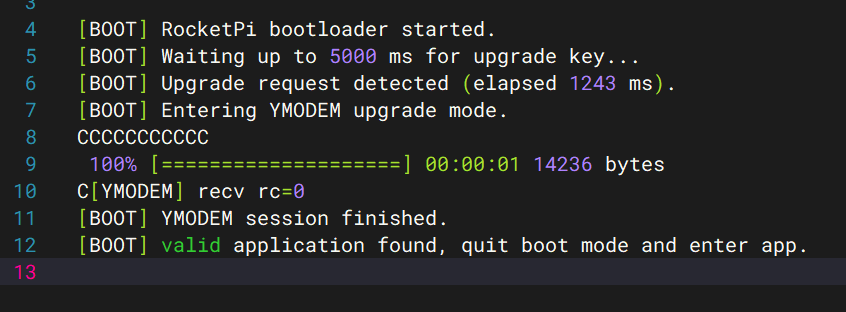
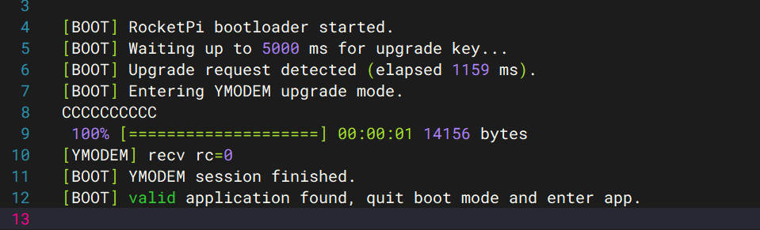
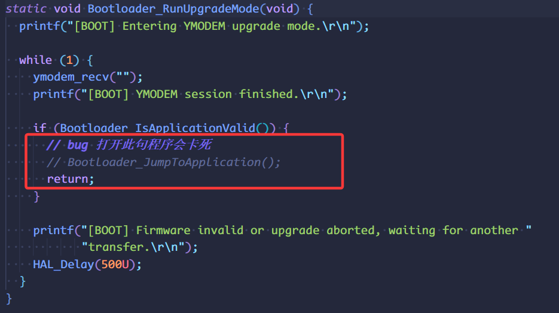
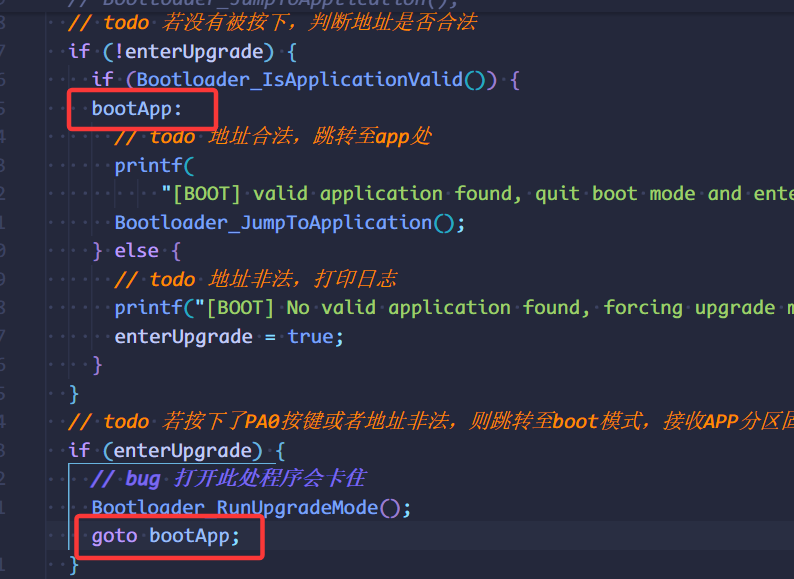

<!--
 * @Author: majorzpley wyx1214844230@outlook.com
 * @Date: 2026-01-31 10:45:41
 * @LastEditors: majorzpley wyx1214844230@outlook.com
 * @LastEditTime: 2026-03-10 15:42:38
 * @FilePath: /01_rocketpi_bootloader_iap/readme.md
 * @Description: rocketpi点灯程序，
 * 不用客气，这是你应该谢的!
 * Copyright (c) 2026 by ${git_name_email}, All Rights Reserved. 
-->
# 一、debug问题
遇到的问题可以参考这篇帖子：https://community.platformio.org/t/python-error-on-vscode-cannot-start-debug-session/53407/5<br>
- 开发分支新增了对 Python 3.14 的支持
```bash
pio upgrade --dev
```

# 二、PlatformIO 配合 clangd 插件解决方案
由于微软自带插件的智能扫描运行起来太慢，故采用此方案，参考此篇文章：https://blog.csdn.net/weixin_44434849/article/details/127539447

在 *platform.ini* 中添加
```ini
build_flags = -Ilib -Isrc
```
在命令行输入：
```bash
pio run -t compiledb
```
即可生成.json文件
# 三、实验说明
基于 STM32F401 的引导加载器与应用示例，使用 platformio.ini 来管理两个项目 **app、bootloader**
## Boot 工程
- 固定应用起始地址为 0x08020000，最大占用 0x60000 字节。
- 上电后读取应用向量表的初始栈指针与复位入口，确认栈指针位于 SRAM (0x20000000 ~ 0x20017FFF) 且复位入口位于应用地址范围内。
- 校验通过即清理时钟/SysTick 状态、重定位 VTOR，并跳转到应用入口函数；
- 初始化 GPIOX，蓝绿粉 LED灯会常亮3S左右，然后会跳转到App程序。
## App 工程
- 将 SCB->VTOR 重定位到 0x08020000 以匹配 Boot 的跳转策略。
- 初始化 GPIOX，引导示例每 500 ms 翻转一次 蓝绿粉 灯，验证应用被正确执行。
## 目录结构
- bootloader/：引导加载器源码。
- app/：用户应用源码，app/readme.md 记录了相同的起始地址信息。
- platformio.ini：工程管理文件
## 使用说明
- 依次编译并下载 bootloader 与 app1 与 app2 工程（推荐先下载 Bootloader，再下载 App）。
- 只需烧写 bootloader 程序可通过 ymodem 工具烧写 app1 或者 app2，生成的app1和app2的bin文件拷贝已至**output**文件夹中重命名
- app1：蓝绿粉LED灯1S间隔按照顺序依次循环闪烁

- app2：蓝绿粉LED以500ms间隔同时依次循环闪烁

# 四、已知bug

实验时发现，如果在图示此处直接跳转app，app并没有正常运行，也不是bin文件大小问题，我debug无法复现这个问题(debug时正常🧐)。

这里我直接返回函数，在此处使用goto语句，目前功能正常，app1和app2运行均正常，目前不清楚造成这个bug的原因是什么😔