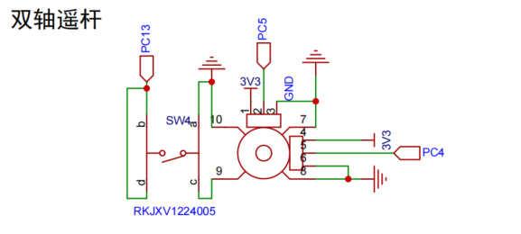
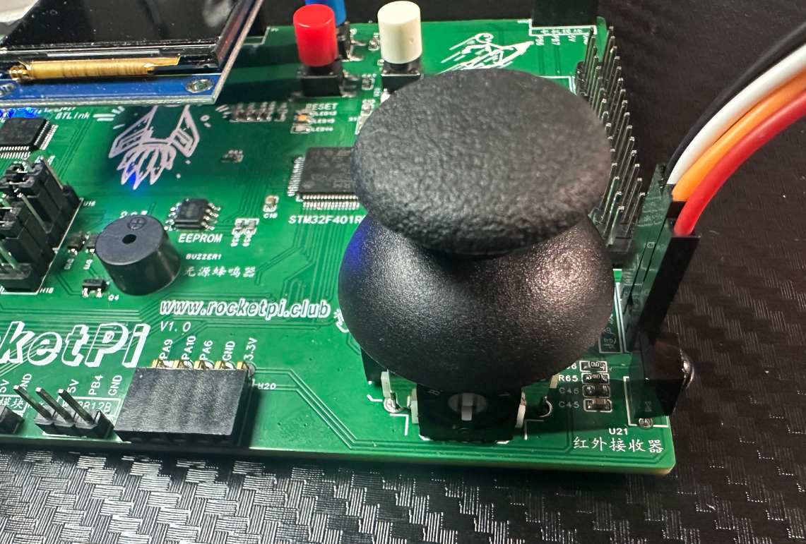
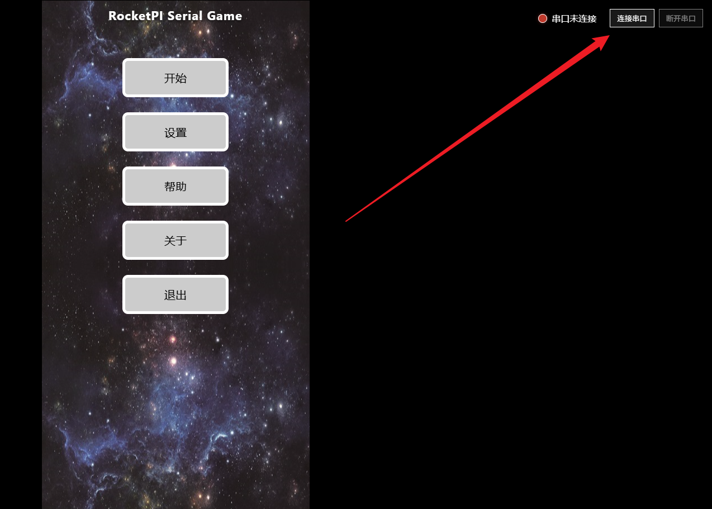
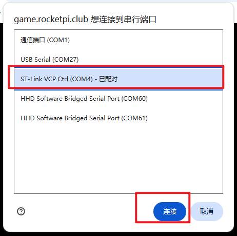
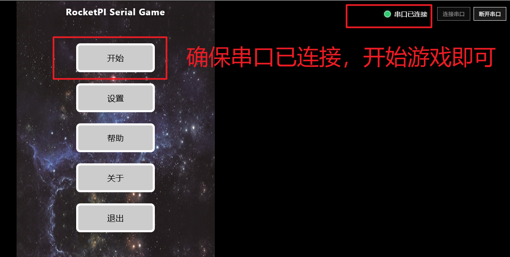
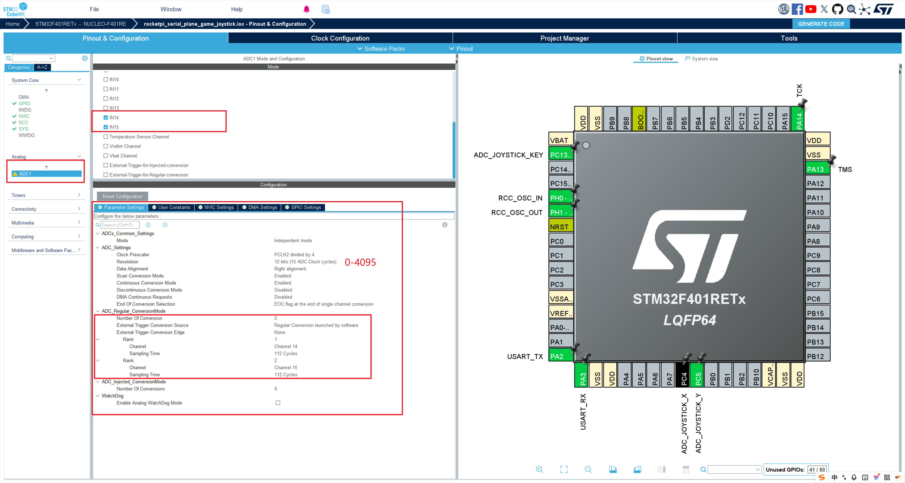
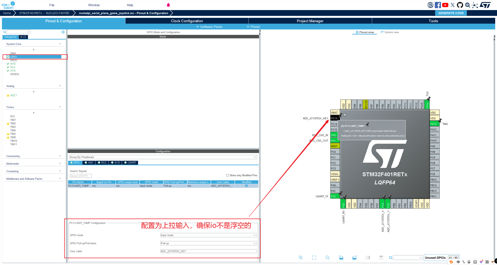

<!--
 * @Author: majorzpley wyx1214844230@outlook.com
 * @Date: 2026-01-31 10:45:41
 * @LastEditors: majorzpley wyx1214844230@outlook.com
 * @LastEditTime: 2026-03-10 16:29:49
 * @FilePath: /01_rocketpi_serial_plane_game/readme.md
 * @Description: 
 * 不用客气，这是你应该谢的!
 * Copyright (c) 2026 by ${git_name_email}, All Rights Reserved. 
-->
# 一、debug问题
遇到的问题可以参考这篇帖子：https://community.platformio.org/t/python-error-on-vscode-cannot-start-debug-session/53407/5<br>
- 开发分支新增了对 Python 3.14 的支持
```bash
pio upgrade --dev
```

# 二、PlatformIO 配合 clangd 插件解决方案
由于微软自带插件的智能扫描运行起来太慢，故采用此方案，参考此篇文章：https://blog.csdn.net/weixin_44434849/article/details/127539447

在 *platform.ini* 中添加
```ini
build_flags = -Ilib -Isrc
```
在命令行输入：
```bash
pio run -t compiledb
```
即可生成.json文件
# 三、实验说明
## 功能说明
使用ADC双轴遥控杆 发送控制指令，通过USB串口连接到电脑上,即可开启打飞机游戏
- 遥杆上滑，串口发送8，飞机前进，
- 遥杆下滑，串口发送4，飞机左移，
- 遥杆右滑，串口发送6，飞机右移，
- 遥杆左滑，串口发送5，飞机后退
## 硬件连接


## 使用方法
下载程序到开发板
访问 https://game.rocketpi.club/ （复制到浏览器打开，最好是chrome浏览器或者edg浏览器） （若画面不全，则刷新一下，等待加载完成即可）
- 点击连接串口

- 选择 ST-Link 的串口并连接

- 确保串口成功连接 ，点击开始游戏即可进入游戏界面，使用遥杆就可以开始飞行大作战了

## 所需外设
- uart
- adc_joystick(ADC遥杆)
## CubeMX配置
- 配置双通道 IN14 IN15对应PC4 PC5
- 分频配置PCLK2 =84M 84/4 = 21M = 47.6ns
- 对 STM32F4 来说，**总转换时间 ≈ 采样时间 + 12.5 个周期** （112+12.5）x 47.6 每个通道一次转换大约 6 µs 左右

该双轴遥杆还带一个按键，低电平触发

## 效果展示
