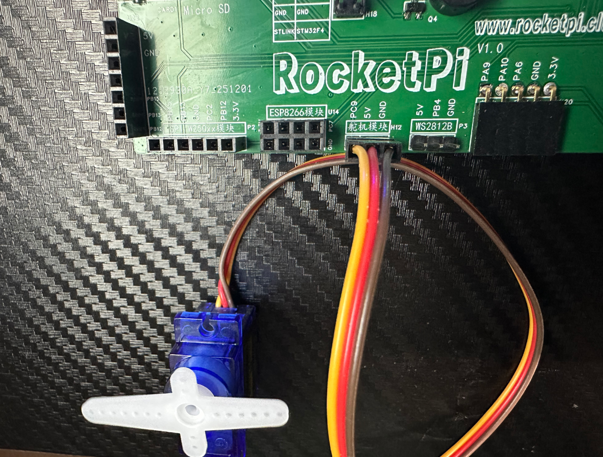
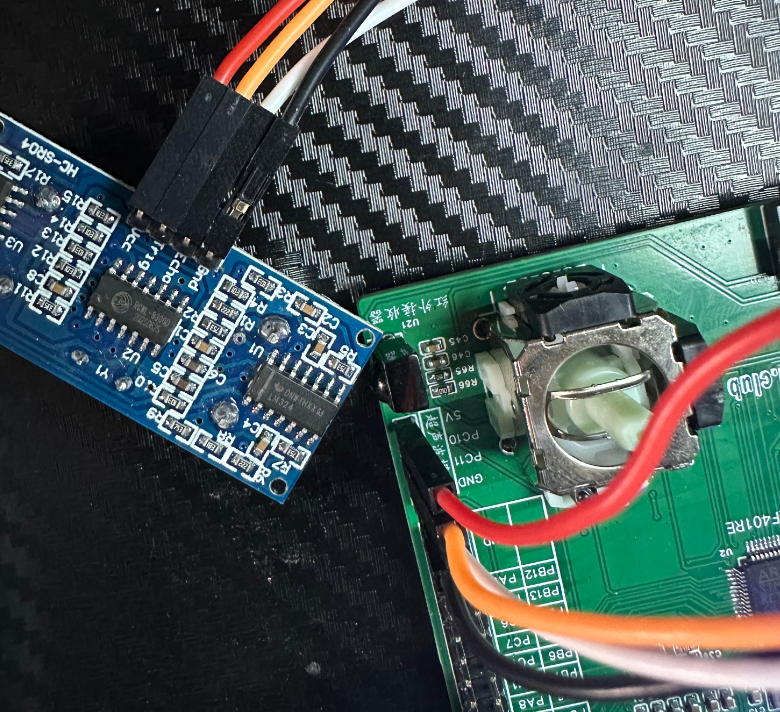
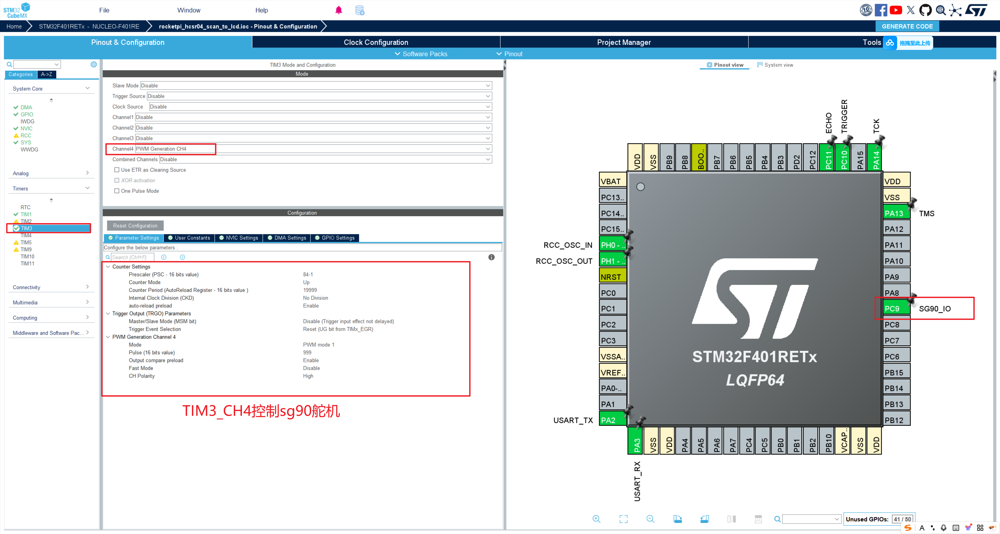
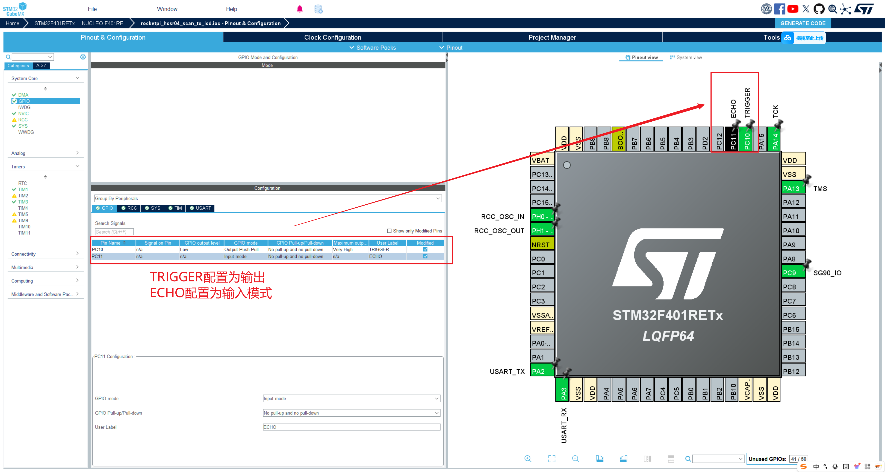
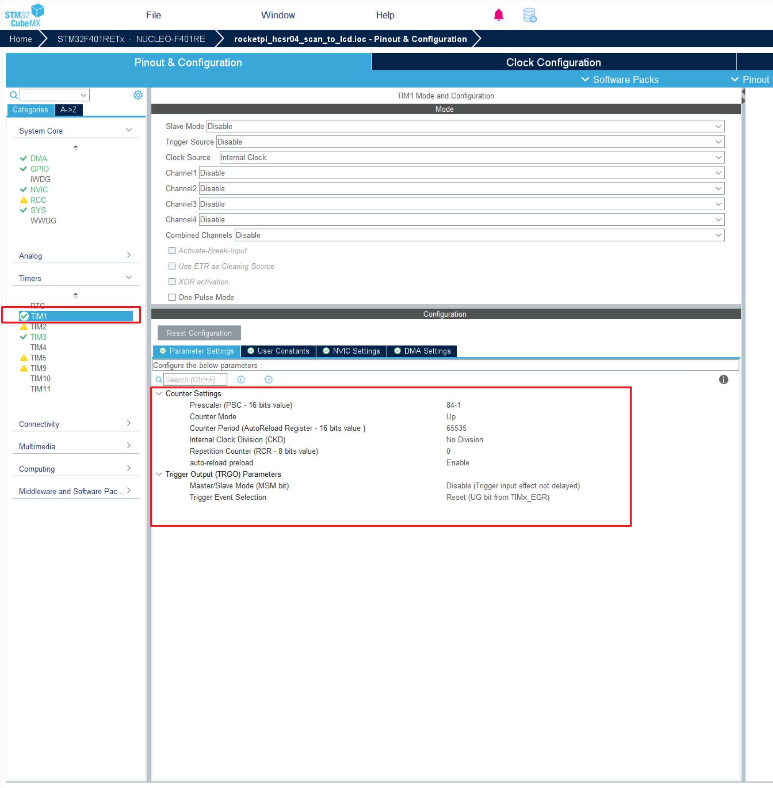
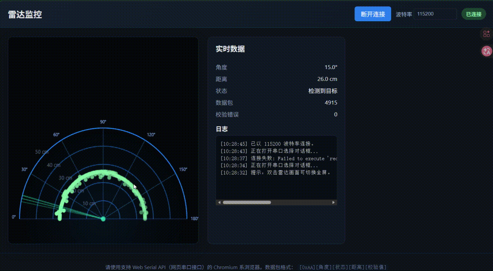

<!--
 * @Author: majorzpley wyx1214844230@outlook.com
 * @Date: 2026-01-31 10:45:41
 * @LastEditors: majorzpley wyx1214844230@outlook.com
 * @LastEditTime: 2026-03-19 10:33:09
 * @FilePath: /04_rocketpi_hcsr04_radar/readme.md
 * @Description: USB CDC 回环示例
 * 不用客气，这是你应该谢的!
 * Copyright (c) 2026 by ${git_name_email}, All Rights Reserved. 
-->
# 一、debug问题
遇到的问题可以参考这篇帖子：https://community.platformio.org/t/python-error-on-vscode-cannot-start-debug-session/53407/5<br>
- 开发分支新增了对 Python 3.14 的支持
```bash
pio upgrade --dev
```

# 二、PlatformIO 配合 clangd 插件解决方案
由于微软自带插件的智能扫描运行起来太慢，故采用此方案，参考此篇文章：https://blog.csdn.net/weixin_44434849/article/details/127539447

在 *platform.ini* 中添加
```ini
build_flags = -Ilib -Isrc
```
在命令行输入：
```bash
pio run -t compiledb
```
即可生成.json文件
# 三、实验说明
## 功能说明
- **HCSR04雷达+SG90电机+串口** 结合上位机，实现简单的毫米波雷达
## 硬件连接
### SG90舵机硬件连接
- SG90 ---PC9

### HCSR04硬件连接
- TRIGGER ---PC10
- ECHO --- PC11

## CubeMX配置
### SG90配置

### HCSR04 IO配置

定时器1配置为1us计数

## 效果展示
