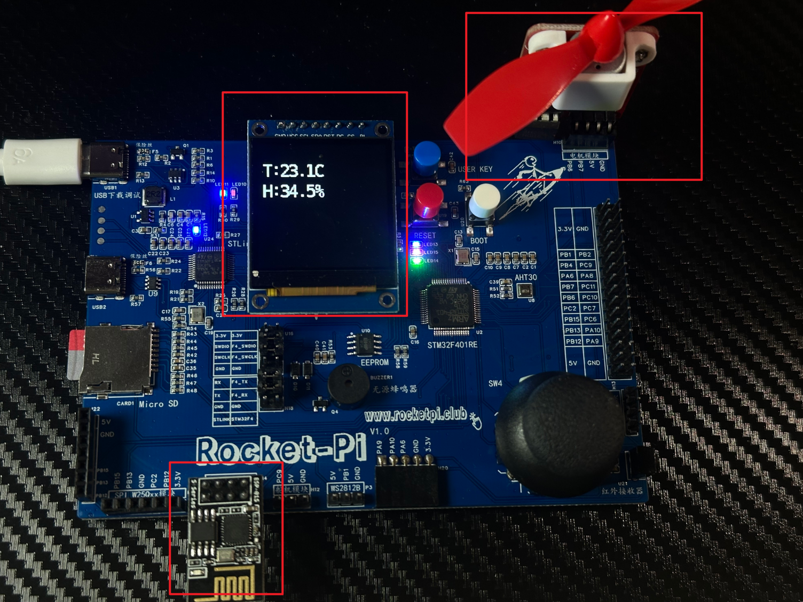

<!--
 * @Author: majorzpley wyx1214844230@outlook.com
 * @Date: 2026-01-31 10:45:41
 * @LastEditors: majorzpley wyx1214844230@outlook.com
 * @LastEditTime: 2026-03-19 20:55:18
 * @FilePath: /05_rocketpi_smart_home/readme.md
 * @Description: 
 * 不用客气，这是你应该谢的!
 * Copyright (c) 2026 by ${git_name_email}, All Rights Reserved. 
-->
# 一、debug问题
遇到的问题可以参考这篇帖子：https://community.platformio.org/t/python-error-on-vscode-cannot-start-debug-session/53407/5<br>
- 开发分支新增了对 Python 3.14 的支持
```bash
pio upgrade --dev
```

# 二、PlatformIO 配合 clangd 插件解决方案
由于微软自带插件的智能扫描运行起来太慢，故采用此方案，参考此篇文章：https://blog.csdn.net/weixin_44434849/article/details/127539447

在 *platform.ini* 中添加
```ini
build_flags = -Ilib -Isrc
```
在命令行输入：
```bash
pio run -t compiledb
```
即可生成.json文件
# 三、实验说明
## 功能说明
- ESP01S AT：Wi-Fi + MQTT 连接
- AHT30：温湿度采集并 MQTT 发布
- LED：蓝/绿/粉三色独立控制
- 电机：L9110 正转/反转/停止
- 无源蜂鸣器：频率 1000-3000 Hz
- ST7789 LCD：未连接时显示 ESP8266/Wi-Fi/MQTT 状态，连接成功后显示温湿度与设备编码
## 硬件连接

## MQTT主题(deviceid自动生成)
- 发布：rocketpi/sensors/<deviceId>/aht30
- 订阅：
- LED：rocketpi/actuators/<deviceId>/led/cmd
- 电机：rocketpi/actuators/<deviceId>/motor/cmd
- 蜂鸣器：rocketpi/actuators/<deviceId>/buzzer/cmd
## 控制指令
LED:
```json
{"cmd":"led","id":"b","state":1}

{"cmd":"led","b":1,"g":0,"p":1}

{"cmd":"led","state":1}
```
电机(速度 0-100):
```json
{"cmd":"motor","dir":"forward","speed":60}

{"cmd":"motor","dir":"reverse","speed":60}

{"cmd":"motor","dir":"stop"}
```
蜂鸣器（频率 1000-3000 Hz）：
```json
{"cmd":"buzzer","state":1,"freq":2000}

{"cmd":"buzzer","state":0}
```
说明：cmd 可省略，使用对应订阅主题即可
## 运行说明
- 在 app/app.c 配置 APP_WIFI_SSID、APP_WIFI_PASSWORD 等宏。
- 设备启动后会显示 12 位小写字母的编码（deviceId），用于工具端输入与主题匹配。
- Web 控制台见 tools/README.md。
## 效果展示
# 四、已知bug
目前我能扫描到家里的2.4Gwifi，但是却连接不上
```bash
ERROR
+CWJAP: 4
```
，暂时不折腾了，可能是我路由器设置的问题，我尝试很久依然没法解决，先上传代码吧，源码应该时没有问题的
